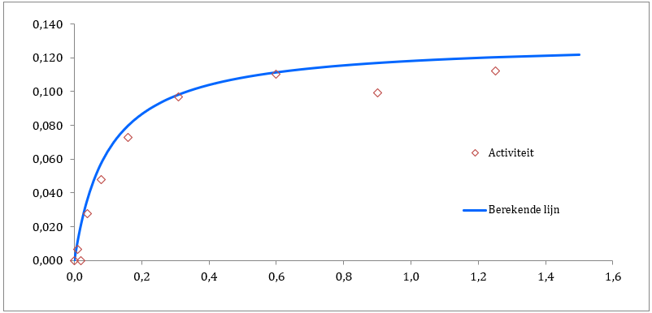

```{r}
#Libraries:
library(ggplot2)
```


In dit bestand ga ik een Exploratory Data Analysis uitvoeren om te kijken hoe de Excel sheets in elkaar zitten en hoe ik dit om kan zetten naar R. Ik heb twee verschillende excel sheets ontvangen, één met een enkele curve en één met een dubbele curve.

# Enkele curve

Het excel-sheet maakt een Michaelis-Menten curve (MM-curve) op basis van gemeten activiteit (v) bij concentraties (S). De gemeten data punten worden in een grafiek geplot en hierdoor wordt lijn getrokken. Een voorbeeld uit de excel-sheet van hoe dit er uit ziet is in afbeelding 1 te zien.



Om te beginnen met het omzetten van de excel-sheet naar R, ga ik eerst deze afbeelding namaken.

```{r}
plot_data <- data.frame(
  concentratie = c(1.25, 0.90, 0.60, 0.31,
                   0.16, 0.08, 0.04, 0.02, 0.01),
  activiteit = c(1.12e-01, 9.90e-02, 1.10e-01, 9.66e-02,
                 7.27e-02, 4.80e-02, 2.75e-02, 0.00e00, 6.71e-03)
)
print(plot_data)
```
Alle datapunten zijn nu opgeslagen in een dataframe, deze kunnen nu geplot worden.

```{r}
ggplot(plot_data, aes(x = concentratie, y = activiteit)) +
  geom_point() +
  ylim(0.0, 0.140) +
  xlim(0.0, 1.6) +
  theme_minimal()
```

De datapunten zijn nu geplot, maar nu moet er nog een curve gefit worden door de punten.

```{r}
ggplot(plot_data, aes(x = concentratie, y = activiteit)) +
  geom_point() +
  geom_smooth(method = loess, color = "red", se = FALSE) +
  ylim(0.0, 0.140) +
  xlim(0.0, 1.6) +
  theme_minimal()
```

Dit is een eerste test voor het fitten van de curve en moet nog verbeterd worden.


# Dubbele curve