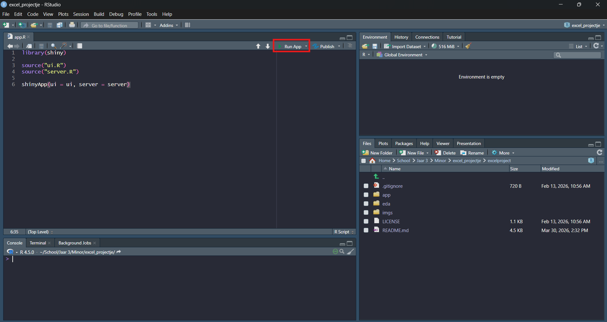
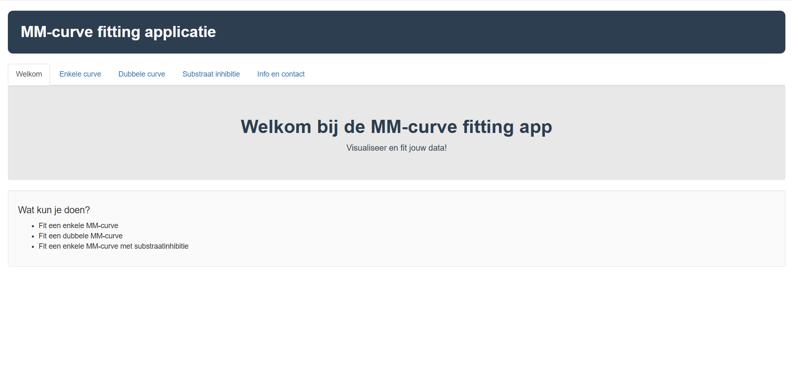
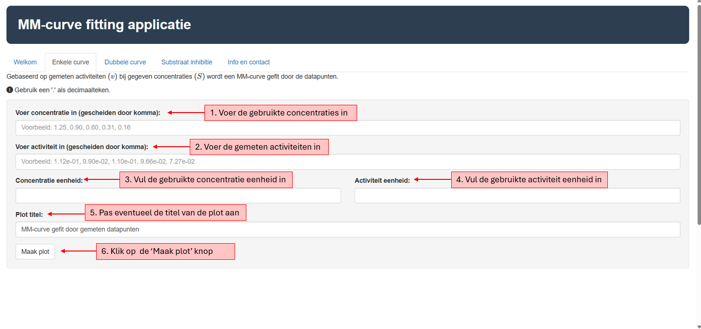
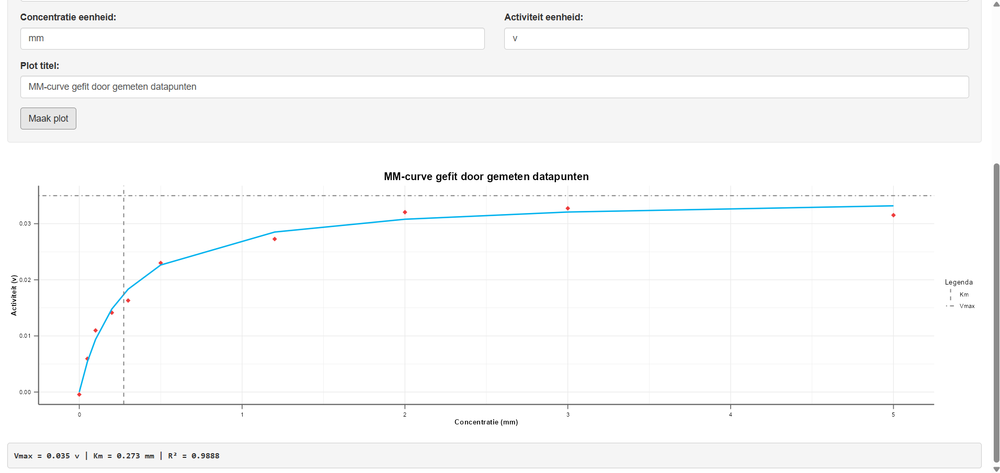
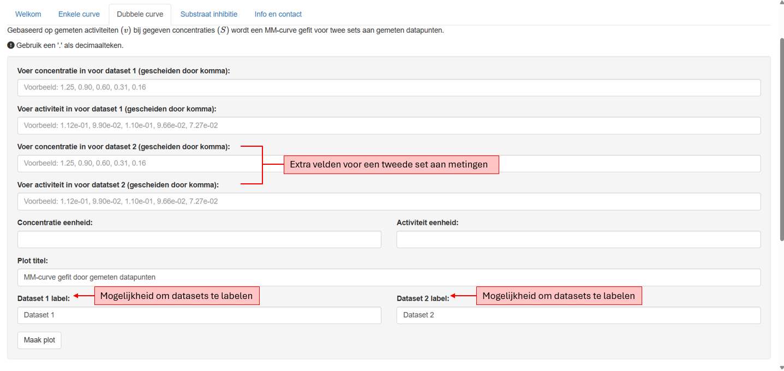
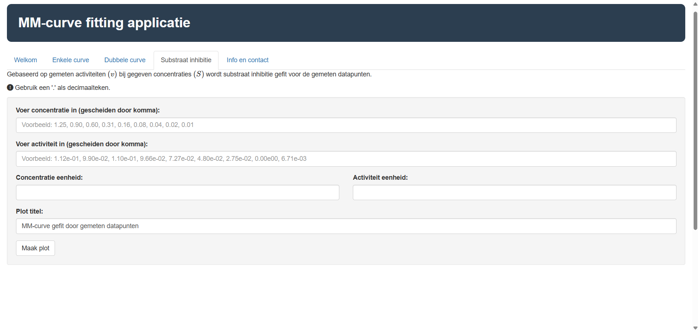
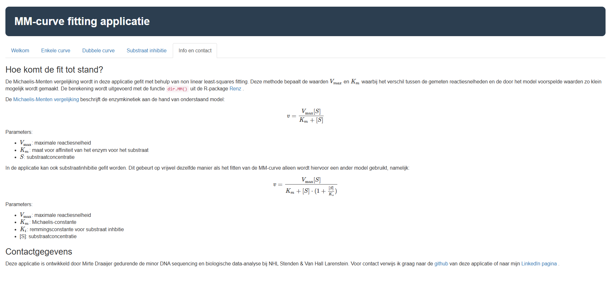

# MM-curve fitting applicatie

Een dashboard voor het fitten van MM-curves aan gemeten datapunten. De applicatie is ontwikkeld op basis van Excel-sheets van NHL Stenden & van Hall Larenstein.

## Auteur

-   Mirte Draaijer

## Beschrijving

In dit dashboard kan de gebruiker gemeten enzymconcentraties en enzymactiviteiten invoeren. Op basis hiervan wordt een MM-curve gefit. Deze curve kan vervolgens worden gebruikt voor verdere analyse en/of rapportage van de gemeten data.

## Systeemvereisten en installatie

-   OS: Windows 11, Linux, macOS
-   R: 4.5.0 of hoger

**Kloon de repository:**

``` bash
git@github.com:MirteDraaijer/MM-curve_applicatie.git
```

**Installeer de benodigde R-packages:**

``` r
  install.packages(c(
    "shiny",
    "ggplot2",
    "renz",
    "minpack.lm"
  ))
```

### Versiedetails

De applicatie is gemaakt met R versie [4.5.0](https://cran.r-project.org/bin/windows/base/old/4.5.0/) en onderstaande R-packages zijn gebruikt in de applicatie:

| Package:                                         | Beschrijving:                                                  |Versie:|
|--------------------------------------------------|----------------------------------------------------------------|-------|
| [shiny](https://github.com/rstudio/shiny)        | Gebruikt voor het maken van de applicatie.                     |1.13.0 |
| [ggplot](https://github.com/tidyverse/ggplot2)   | Gebruikt voor het maken van de visualisaties.                  | 3.5.2 |
| [renz](https://github.com/jcaledo/renzGH)        | Gebruikt voor het fitten van de MM-curve door de data.         | 0.2.1 |
| [minpack.lm](https://github.com/cran/minpack.lm) | Gebruikt voor het fitten van substraat-inhibitie door de data. | 1.2-4 |

## De applicatie uitvoeren

Als de applicatie is geïnstalleerd zoals beschreven in [systeemvereisten en installatie](#systeemvereisten-en-installatie) 
dan kan het bestand `app.R` geopend worden in RStudio. Na het openen van `app.R` 
in RStudio is er bovenaan het document een knop te zien: 



Als er op deze knop wordt geklikt, wordt de applicatie uitgevoerd. Verdere uitleg over de werking van de applicatie is te vinden in [de gebruikershandleiding](#gebruikershandleiding).

Op dit moment wordt de applicatie nergens gehost. Daardoor is de enige manier voor gebruikers om de applicatie te gebruiken het clonen van de repository en deze lokaal uit te voeren.

## Gebruikershandleiding

De MM-curve fitting applicatie heeft een aantal tabladen en functionaliteiten waaruit 
gekozen kan worden. In deze sectie zal elk tablad kort doorlopen worden, met waar nodig
instructies over hoe deze functionaliteit gebruikt kan worden.

### Welkomstpagina

Wanneer de app geopend wordt, beland je op het welkomstscherm. Hier kan in de menubalk bovenin gekozen worden voor:

- Welkom: de pagina waarop je op dit moment bent.
- Enkele curve: op deze pagina kan een enkele curve gefit worden.
- Dubbele curve: op deze pagina kan een dubbele curve gefit worden.
- Substraat inhibitie: op deze pagina kan substraat inhibitie gefit worden.
- Info en contact: op deze pagina staat aanvullende informatie en de contactgegevens.



### Enkele curve

Op deze pagina kan een enkele curve geplot worden. In onderstaande afbeelding is stapsgewijze beschreven hoe dit werkt.



1. In dit veld kunnen de gebruikte concentraties ingevuld worden, belangrijk is dat hier een `.` als decimaalteken wordt gebruikt en een `,` als scheidingsteken.
2. In dit veld kunnen de gemeten concentraties ingevuld worden, belangrijk is dat hier een `.` als decimaalteken wordt gebruikt en een `,` als scheidingsteken.
3. In dit veld kan de gebruikte concentratie eenheid ingevuld worden.
4. In dit veld kan de gebruikte activiteit eenheid ingevuld worden.
5. Als dit gewenst is kan de titel van de plot nog aangepast worden, als dit niet wordt gedaan, wordt de standaard gebruikt.
6. Wanneer op deze knop wordt geklikt, wordt er een plot gegenereerd.

Wanneer alle stappen correct zijn doorlopen ontstaat er een plot zoals onderstaande.



Hierbij is de gefitte curve in het blauw geplot en de gemeten datapunten in het rood. Vmax en Km zijn weergegeven met een gestippelde lijn. Onder de plot staan de Vmax, Km en R² tekstueel beschreven.

### Dubbele curve

Op deze pagina kan een dubbele curve geplot worden. Deze pagina werkt grotendeels hetzelfde als de enkele curve, met een paar extra toevoegingen.



In de afbeelding is te zien dat er een extra invoerveld is gekomen voor de concentratie en de activiteit. Ook zijn er twee andere invoervelden bijgekomen namelijk `Dataset 1 label` en `Dataset 2 label`, in deze invoervelden kunnen de datasets gelabeld worden zodat duidelijk is welke curve hoort bij welk enzym.

Naast deze extra toevoegingen werkt het dubbele curve tablad hetzelfde als het enkele curve tablad.


### Substraat inhibitie

Op deze pagina kan substraat inhibitie gefit worden. In onderstaande afbeelding is te zien hoe de pagina eruitziet.



Dit tablad ziet er hetzelfde uit als de enkele curve, maar het onderliggende model voor het fitten van de curve ziet er anders uit. De werking van dit tablad is voor de gebruiker hetzelfde als de enkele curve.


### Info en contact

Tot slot bevat de applicatie nog een info en contact pagina, hierop is achtergrond informatie te vinden over hoe de fits tot stand komen en contactgegevens mochten er vragen of problemen zijn. In onderstaande afbeelding is te zien hoe dit tablad eruit ziet.




## Ondersteuning

In het geval van bugs of als er ondersteuning nodig is, open een issue op de [repository](https://github.com/MirteDraaijer/MM-curve_applicatie/issues).
