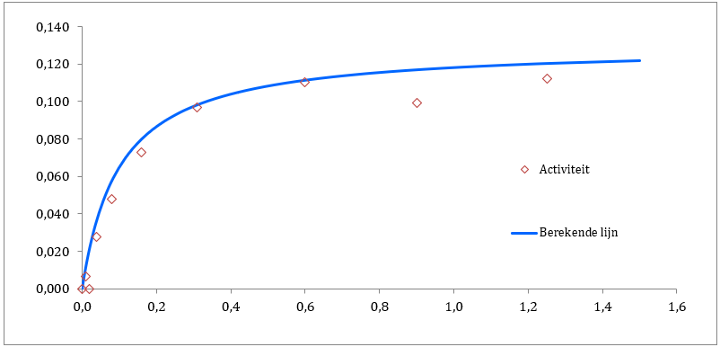

```{r}
#Libraries:
library(ggplot2)
library(renz)
library(minpack.lm)
```

In dit bestand ga ik een Exploratory Data Analysis uitvoeren om te kijken hoe de Excel sheets in elkaar zitten en hoe ik dit om kan zetten naar R.
Ik heb twee verschillende Excel sheets ontvangen, één met een enkele curve en één met een dubbele curve.

# Enkele curve

Het Excel-sheet maakt een Michaelis-Menten curve (MM-curve) op basis van gemeten activiteit (v) bij concentraties (S).
De gemeten data punten worden in een grafiek geplot en hierdoor wordt lijn getrokken.
Een voorbeeld uit de Excel-sheet van hoe dit er uit ziet is in afbeelding 1 te zien.



Om te beginnen met het omzetten van de Excel-sheet naar R, ga ik eerst deze afbeelding namaken.

```{r}
plot_data <- data.frame(
  concentration = c(1.25, 0.90, 0.60, 0.31,
                    0.16, 0.08, 0.04, 0.02, 0.01),
  activity = c(1.12e-01, 9.90e-02, 1.10e-01, 9.66e-02,
               7.27e-02, 4.80e-02, 2.75e-02, 0.00e00, 6.71e-03)
)

print(plot_data)
```

Alle datapunten zijn nu opgeslagen in een dataframe, deze kunnen nu geplot worden.

```{r}
ggplot(plot_data, aes(x = concentration, y = activity)) +
  geom_point() +
  theme_minimal()
```

De datapunten zijn nu geplot, maar nu moet er nog een curve gefit worden door de punten.
De library `renz` heeft een functie genaamd `dir.MM()` deze functie kan een MM-curve fitten door een dataset.

```{r}
fit_values <- dir.MM(plot_data, plot = FALSE)
fit_values$data
```

De fit wordt opgeslagen in een dataframe, deze is hierboven te zien.
Deze dataframe kan gebruikt worden om de fit samen met de gemeten data te plotten in 1 grafiek.

```{r}
ggplot(plot_data, aes(x = concentration, y = activity)) +
  geom_point(color = "brown2", shape = 18, size = 3) +
  geom_line(data = fit_values$data, aes(x = S, y = fitted_v), color = "deepskyblue2", size = 1) +
  labs(
    title = "MM-curve gefit door gemeten datapunten",
    x = "Concentratie",
    y = "Activiteit"
  ) +
  theme_minimal() +
  theme(plot.title = element_text(hjust = 0.5))
```

De functie maakt een mooie fit door de datapunten heen.
Ik moet nog wel even navragen in wat voor eenheden de metingen worden gedaan zodat ik de assen mooi compleet kan maken.

# Dubbele curve

Het tweede Excel sheet bevat functionaliteiten voor een dubbele curve.
Hierbij zijn twee tabellen aanwezig waarin meet-waardes ingevuld kunnen worden en door de data uit deze tabellen worden 2 verschillende MM-curves geplot.
De functionaliteit is inprincipe hetzelfde als het eerste Excel-sheet.
Om deze reden ga ik ook geen verder analyse doen voor deze Excel-sheet.

# Substraat inhibitie

Ik heb ook nog een Excel-sheet ontvangen over substraat inhibitie.
Dit wil ik ook toevoegen aan de applicatie.
Ik zal eerst een kleine exploratieve analyse doen voordat ik dit toevoeg aan de applicatie.

In deze Excel-sheet wordt gebruik gemaakt van de volgende formule:

$v = \frac{V_{max} \cdot [S]}{{K_m} + {[S]} \cdot ( 1 + \frac{[S]}{K_s})}$

Helaas is er gene R-package die specifiek deze formule heeft, daarom ga ik het zelf als functie definieren om op te kunnen lossen.

```{r}
fit_si <- nlsLM(
  activity ~ (Vmax * concentration) / (Km + concentration * (1 + concentration / Ki)),
  data = plot_data,
  start = list(Vmax = 0.13, Km = 0.13, Ki = 0.2),
  control = nls.lm.control(maxiter = 500)
)

summary(fit_si)
```

```{r}
plot_data$fitted_v <- predict(fit_si, newdata = plot_data)
```

```{r}
ggplot(plot_data, aes(x = concentration, y = activity)) +
  geom_point(color = "brown2", shape = 18, size = 3) +
  geom_line(data = fit_values$data, aes(x = S, y = fitted_v), color = "deepskyblue", size = 1) +
  geom_line(aes(y = fitted_v), color = "deepskyblue4", size = 1) +
  labs(
    title = "MM-curve & substraat inhibitie voor gemeten datapunten",
    x = "Concentratie",
    y = "Activiteit"
  ) +
  theme_minimal() +
  theme(plot.title = element_text(hjust = 0.5))
```

De figuur heeft nog een legenda nodig en de substraat inhibitie staat nog niet in een functie maar dat is zo gebeurt.
De substraat inhibitie lijkt in elk geval te werken.

# Vmax en Km extraheren:

In de applicatie wil ook de Vmax en de Km weergeven, ik ga kijken hoe ik deze uit de resultaten van `Renz` kan krijgen.

De Km en Vmax staan in `parameters` van het gefitte model, hierbij staat de Km op positie 1.

```{r}
fit_values$parameters[1]
```

Vmax staat op positie 2.

```{r}
fit_values$parameters[2]
```

Om dit toe te passen in de applicatie kan ik deze waarden halen uit het gefitte model en als een tekst toevoegen.

# R^2 berekenen:

Ook wil ik de R^2 toevoegen aan de applicatie, deze moet ik nog berekenen. Voor de enkele- en dubbele curve heb ik gebruik gemaakt van `dir.MM()`, voor de substraat inhibitie curve heb ik zelf een model geschreven. Voor de enkele curve en de substraat inhibitie curve zal ik nu de R^2 berekenen.

Allereerst de benodigde gegevens ophalen

```{r}
obs_single <- plot_data$activity
pred_single <- fit_values$data$fitted_v
```

```{r}
obs_sub <-plot_data$activity
pred_sub <- plot_data$fitted_v
```

Daarna een functie maken voor het berekenen van R^2

```{r}
calc_R2 <- function(obs, pred) {
  1 - sum((obs - pred)^2) / sum((obs - mean(obs))^2)
}
```

Tot slot met behulp van de functie de R^2 berekenen

```{r}
print("R^2 voor enkele curve model")
calc_R2(plot_data$activity, fit_values$data$fitted_v)

print("R^2 voor substraat inhibitie model")
calc_R2(plot_data$activity, plot_data$fitted_v
```


